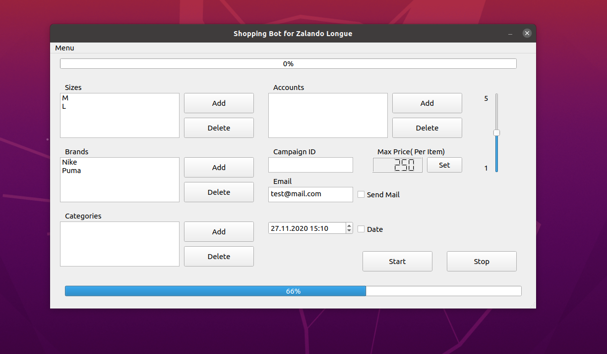

# Zalando Longue Shopping Bot
The bot was created for the mozilla firefox browser, on linux ubuntu 20.04, written in python version 3.8.

Date: 3 June 2020

## Table of contents
* [Introduction](#Introduction)
* [General info](#general-info)
* [Code Example](#code-example)
* [Production Details](#Production-Details)
* [Launch](#launch)
* [Installation](#installation)
* [Technologies](#technologies)

## Introduction
Let me start with a general rundown of the problem. (drop - sale, drop of one brand of clothes).
There are various sites that offer groupings of such drops, e.g. zalando has a site dealing with such issues - zalando-longue.
It works on the basis that, for example, 5 days earlier, there is an e-mail announcement that the drop of Ralph Lauren clothes is to be at 6:00 am. But what's so interesting about it and what's the problem?
In fact, these are often very large discounts, even up to 80%. Vans shoes worth PLN 300 could be bought for PLN 70.
The problem is that not only we know about these drops and all these items sell out within a few or a dozen minutes, there is a real madness there, the sizes disappear in the blink of an eye.

One of the (in my opinion) interesting walkthroughs is writing a Shopping Bot.
The bot would enter the website, log in, find a drop after the "Ralph" tag and now go through all the goods and check if they are as expected
eg "green", "shirt", "ralph", "L". The program does not have to buy anything theoretically, it adds acceptable items to the basket in which the item can exist (probably for half an hour).
So, after 10-15 minutes of botting I can enter my cart into my account and select items that I want or not.
I know it's rather illegal, but there are also various groups on Facebook where you can earn money from the so-called
 proxy, i.e. the item in the basket is sold, (for example PLN 50 more)
because it is no longer available in zalando-longue. At normal price this product is worth 2x more or it can be special for someone.
In such a drop, everything that is potentially interesting is included.
Items are thrown from the basket as a post on the group and then consciously 
people buy these items indirectly although(for example PLN 50 more) knowing that it was cheaper on zalando.

I emphasize that this has never happened in my case, but I know it is happening :).

## General Info


### Database
Registration allows users to save their preferences for next next shopping in cloud database. 
Inputting an email gives possibility to notify you via mail about that
finished work of bot.


### Campaign ID
#### Description
To get the campaign id of the upcoming sale,
please find it in the "Coming Soon" section
 that appears after logging in to the zalando longue website.
 Right-click and choose inspect element. Then look for the ID in the source code.
Example included in the photo below.


## Code Example
```python
 def perform_login(self):
        """
       Logging to account, checks error, sends login and pwd
       :return:
       """
        while True:
            try:
                WebDriverWait(self.driver, 5).until(
                    ec.element_to_be_clickable((By.XPATH, '//*[@id=\"uc-btn-accept-banner\"]'))).click()
                break
            except StaleElementReferenceException:
                pass
        self.driver.find_element_by_xpath(
            "/html/body/div[2]/div/div[2]/div[1]/div/div/div[1]/div/div/div[2]/div/div/button").click()
        element = WebDriverWait(self.driver, 25).until(ec.element_to_be_clickable((By.XPATH, '//*[@id="form-email"]')))
        element.send_keys(self.email)
        element = WebDriverWait(self.driver, 20).until(
            ec.element_to_be_clickable((By.XPATH, '//*[@id="form-password"]')))
        element.send_keys(self.password)
        element.submit()
        self.wait_login_error()
```
## Production Details

### 2020.04.26 I week

The bot can also be upgraded in various ways,
- fire a few instead of one,
- one bot for each page,
- modify it to fire it remotely
- expand with foreign sites like ASOS
- general monitoring of e-mails from zalando longue
- automatic setting of the bot for dates from emails,
- simple graphical interface
Modifications and improvements can come up with a lot of interesting extensions.

Generally:
 we are definitely going to take advantage of
- _Selenium_,
- _geckodriver to firefox
- we will describe everything beautifully in readme for everyone to benefit
- BeautifulSoup 4 for html, bs4 structure examination
- PyQt5 - graphical interface
- pyvirtualdisplay open browser in the background. (silent mode)
- smtplib for sending e-mails

and probably many others that we will learn about during the design process.


### 2020.05.03 II week

- Deeper analysis of Zalando structures,
- mastering the basic theory, Selenium documentation,
- logging in to the website
- disabling annoying banners.

### 2020.05.10 III week
Main (scheme beta version) GUI window in PyQt5, a little introduction to PyQt5.
Error handling for:
- not finding an item,
- page loading error,
Item specification. : -
- brand selection
- size selection
- category selection (Structures):
- single 2bQSu
- multiple 2bQSu
- single 23fgc
- function for sending informational e-mails


### 2020.05.17 IV week
The frontend has been completed, some minor touches and functionalities have been left.
The main window was completely changed, the old one was poorly thought out.
Re-analyze the strategy of adding items to the cart. (Bruteforce)
Communication between the bot and the interface was ensured.

- Login panel
- main interface window
- controller for communication between windows
- dynamic lists providing filtering capability
- application icons

We have come to major or minor changes in the structure of our bot's behavior.

 - size optimization,
 - setting maximum prices for itemu (final version),
 - brand setting (final version),
 - adding items to the cart (until reaching shopping_cart max size)

Everything is in the end laps, the entire skeleton stands and works universally (for all sales).


### 2020.05.24 V week
- a function that allows you to send an email informing you that the bot has finished shopping or that the maximum size of the basket has been reached.
the limit of the quantity in the cart was huge and there would be just as many items to buy)
- a function that determines the percentage of categorization of the item - size, price, brand, etc.
- a function that allows you to program the bot temporarily. (e.g. on launch tomorrow at 6:00 am).
- adding item in multiple sizes. (L, M bot is no longer limited to one size)
- the idea and implementation to change the way items are cared for, to make the bot independent from the structure of dynamically changing categories:
    - when downloading hrefs, after scrolling items, download the .text attribute and check whether the item is in the category list from the interface
- a signal informing about the completion of the bot action
- collecting all items (dynamic basket in the interface (I'm not sure if it is redundant))
- UPGRADE project.txt (it is more readable!: D)
- gui modification
    - adding sliders
- functionalities of start and stop buttons have been implemented
- the program now runs on separate subprocesses?
    - when pressing start, a separate procces creates a new one, a new bot object starts (you can open a few
for several configurations)
    - stop, in addition to process termination, turns off browsers and cleans previously used resources
- powerful clean up in main_window - front
- gui -> function documentation

### 2020.05.29 VI week 
- connecting the application to a non-relational database (NoSQL) - firebase, we use the pyrebase library
- establishing the structure of stored documents
- setting rules in the firebase console
- registration of firebase accounts in pyqt5 interface and validation
- logging into the firebase account
- firebase error handling
- documentation of newly developed methods
- saving configuration in the database for a unique user
- reading the user configuration
- communication interface - firebase
- readme ++ (instruction) + english translation
- build script
- launch script
## Launch
```shell script
./run
```
or with
```shell script
python3 Controller.py
```
## Installation
Well firstly you need to install geckodriver in accordance with [_geckodriver_](https://github.com/mozilla/geckodriver/releases).
 Than you can install all needed libs and frameworks with build script:
```shell script
./build 
```` 
## Technologies

#### Libraries and Frameworks Manual
```
pip install pyrebase
```
```
pip install selenium
```
```
pip install PyQt5
```

#### Geckodriver 
##### ( 3 June 2020).
The one problem is Geckodriver (for Firefox).
The module features has the local geckodriver driver version 0.26 for the latest version of firefox 76.0.1 (64-bit)


###### Instruction for geckodriver :
1. Find and download the latest driver version
 [geckodriver newest version](https://github.com/mozilla/geckodriver/releases), example:

    ```wget https://github.com/mozilla/geckodriver/releases/download/v0.26.0/geckodriver-v0.26.0-linux64.tar.gz```
    
2. Then unpack

    ```tar -xvzf geckodriver*```
3. Give the executable permission

    ``chmod +x geckodriver``
4. Add the driver path to the PATH

    ``export PATH=$PATH:/path-to-extracted-file/.``

[ASK UBUNTU HELP LINK GECKODRIVER](https://askubuntu.com/questions/870530/how-to-install-geckodriver-in-ubuntu)

#### Useful links
[firebase](https://firebase.com)
[pyrebase](https://github.com/thisbejim/Pyrebase/blob/master/README.md?fbclid=IwAR0MfG6lXHNXciGdLzK0AdW7lkIUWmNrHd4jQvUjrV8heOXVvvIu2SK1Usw)
[geckodriver askubuntu](https://askubuntu.com/questions/870530/how-to-install-geckodriver-in-ubuntu)
[selenium](https://selenium-python.readthedocs.io/)
[PyQt5](https://pypi.org/project/PyQt5/)
[Python Scripts](https://realpython.com/run-python-scripts/)
